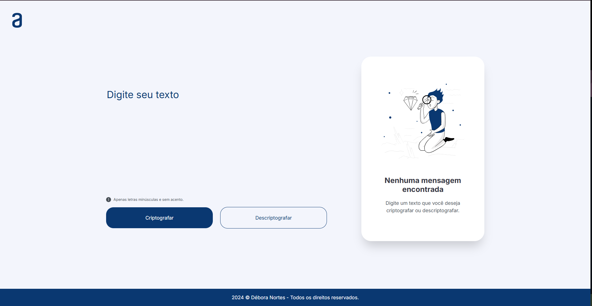

# 🔐 Decodificador de Texto

Projeto desenvolvido como parte do desafio proposto pelo programa **Oracle Next Education (ONE)** em parceria com a **Alura**.

Este decodificador permite **criptografar** e **descriptografar** mensagens usando regras simples de substituição de caracteres. Ideal para trocar mensagens secretas com seus amigos de forma divertida!

---

## 📸 Preview

---

## 🛠 Tecnologias Utilizadas

- **HTML5**
- **CSS3**
- **JavaScript (ES6)**

---

## 🚀 Funcionalidades

- 🔤 **Codificação de texto** com substituições:
  - `e` → `enter`
  - `i` → `imes`
  - `a` → `ai`
  - `o` → `ober`
  - `u` → `ufat`

- 🔓 **Decodificação** com base nas mesmas regras
- ✂️ **Botão de copiar** para a área de transferência
- 📵 **Validação de entrada:** apenas letras minúsculas e sem acentos
- 📱 **Interface responsiva**
- 🖱️ Ao clicar na **logo da Alura**, a página é recarregada e os campos são limpos

---

## 📚 O que aprendi com este projeto

- Manipular **strings** com métodos do JavaScript
- Trabalhar com **eventos** e **DOM**
- Aplicar **validação de campos de texto**
- Desenvolver **interfaces responsivas** com HTML e CSS
- Organizar e estruturar um projeto do zero

---

## 🔗 Acesse o projeto online

👉 [Clique aqui para ver o Decodificador em funcionamento](https://challenge-decodificador-de-texto.vercel.app/)

---

📝 Projeto desenvolvido por mim durante minha jornada de estudos no programa **ONE - Oracle Next Education** com a **Alura**.
